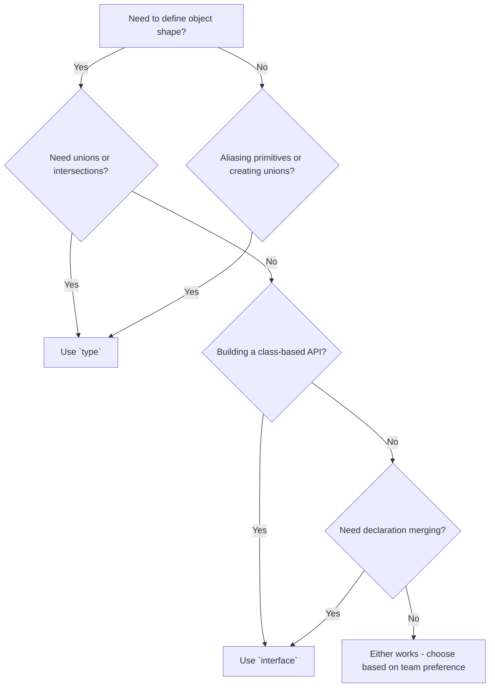

# Typescript
Using TypeScript with Node.js in large-scale applications offers several benefits:

1. **Static Typing**: TypeScript provides static typing, which allows developers to catch errors during development rather than at runtime. This reduces the likelihood of runtime errors, making the codebase more robust and easier to maintain.

2. **Enhanced IDE Support**: TypeScript provides enhanced support for modern IDEs, including code completion, type checking, and refactoring tools. This improves developer productivity and code quality.

3. **Code Readability**: TypeScript code is often more readable and self-explanatory compared to plain JavaScript. The explicit type annotations make the codebase easier to understand for developers, especially when working on large teams or maintaining complex projects.

4. **Scalability**: TypeScript supports features like interfaces, generics, and modules, which facilitate code organization and scalability. This makes it easier to manage and scale large codebases over time, as the project grows in complexity and size.

5. **Ecosystem Compatibility**: TypeScript is fully compatible with existing JavaScript libraries and frameworks. This allows developers to leverage the vast ecosystem of Node.js packages while enjoying the benefits of static typing and other TypeScript features.

6. **Early Error Detection**: TypeScript's static type system helps identify errors and inconsistencies in the codebase early in the development process. By catching errors at compile time, developers can prevent issues from reaching production, reducing debugging time and improving overall software quality.

7. **Maintainability and Refactoring**: TypeScript's type system enables safer and more efficient refactoring of code. Developers can confidently make changes to the codebase, knowing that the TypeScript compiler will catch any type-related errors introduced during refactoring.

Overall, TypeScript enhances the development experience for Node.js applications by providing stronger type checking, improved tooling support, better code organization, and increased productivity, ultimately leading to more maintainable and scalable codebases.


# Why we should prefer Typescript over Javacsript?

we prefer typescript because it enforce typesafety, making the code more predictable and easier to debug. It also improve code quality and maintainibility, especiaaly in large projects.


# Utility Type in Typescript


In TypeScript, utility types are built-in generic types that help transform or construct new types based on existing ones. They simplify common type operations like making properties optional, readonly, or selecting certain keys.


---

✅ Common Utility Types (with examples):

1. Partial<Type>

Makes all properties optional.

type User = {
  id: number;
  name: string;
};

const updateUser = (user: Partial<User>) => {
  // user can have id, name, both, or neither
};

updateUser({ name: "Alice" });


---

2. Required<Type>

Makes all properties required.

type User = {
  id?: number;
  name?: string;
};

const user: Required<User> = {
  id: 1,
  name: "Alice", // now both required
};


---

3. Readonly<Type>

Makes all properties readonly.

type User = {
  id: number;
  name: string;
};

const user: Readonly<User> = {
  id: 1,
  name: "Alice"
};

// user.id = 2; ❌ Error: Cannot assign to 'id' because it is a read-only property.


---

4. Pick<Type, Keys>

Creates a type by picking specific keys from another type.

type User = {
  id: number;
  name: string;
  email: string;
};

type UserPreview = Pick<User, "id" | "name">;

const preview: UserPreview = {
  id: 1,
  name: "Alice"
};


---

5. Omit<Type, Keys>

Creates a type by omitting specific keys.

type User = {
  id: number;
  name: string;
  email: string;
};

type UserWithoutEmail = Omit<User, "email">;

const user: UserWithoutEmail = {
  id: 1,
  name: "Bob"
};


---

🧠 Why use Utility Types?

Reduce code duplication.

Improve type safety and reusability.

Make code cleaner and more expressive.


# Decorators

The **decorator pattern** in TypeScript is a structural design pattern that allows you to add new behaviors to objects dynamically without altering their structure. Decorators are special declarations that can be attached to classes, methods, accessors, properties, or parameters to modify their behavior at runtime¹².

### How Decorators Work
Decorators in TypeScript are prefixed with an `@` symbol and are essentially functions that are called at runtime. Here’s a simple example:

```typescript
function log(target: any, key: string, descriptor: PropertyDescriptor) {
    const originalMethod = descriptor.value;
    descriptor.value = function (...args: any[]) {
        console.log(`Called ${key} with args: ${JSON.stringify(args)}`);
        return originalMethod.apply(this, args);
    };
    return descriptor;
}

class Example {
    @log
    sayHello(name: string) {
        return `Hello, ${name}!`;
    }
}

const example = new Example();
example.sayHello('World'); // Logs: Called sayHello with args: ["World"]
```

In this example, the `log` decorator modifies the `sayHello` method to log its arguments whenever it is called¹².

### When to Use Decorators
Decorators are particularly useful in the following scenarios:

1. **Logging and Monitoring**: Automatically log method calls, parameters, and return values.
2. **Access Control**: Implement role-based access control by checking permissions before executing a method.
3. **Validation**: Validate method parameters or class properties.
4. **Dependency Injection**: Automatically inject dependencies into class constructors or methods.
5. **Metadata**: Add metadata to classes and methods for frameworks like Angular.

### Example Use Case
In a web application, you might use decorators to enforce access control:

```typescript
function adminOnly(target: any, key: string, descriptor: PropertyDescriptor) {
    const originalMethod = descriptor.value;
    descriptor.value = function (...args: any[]) {
        if (!this.isAdmin) {
            throw new Error('Unauthorized');
        }
        return originalMethod.apply(this, args);
    };
    return descriptor;
}

class UserService {
    isAdmin = true;

    @adminOnly
    deleteUser(userId: string) {
        console.log(`User ${userId} deleted`);
    }
}

const service = new UserService();
service.deleteUser('123'); // Works if isAdmin is true
```

In this example, the `adminOnly` decorator ensures that only users with admin privileges can execute the `deleteUser` method¹².


When multiple decorators are applied to a single function in TypeScript, they are executed in a **bottom-up order**. This means the decorator closest to the function definition is executed first, followed by the next closest, and so on¹².

Here's a simple example to illustrate this:

```typescript
function firstDecorator(target: any, propertyKey: string, descriptor: PropertyDescriptor) {
    console.log("First Decorator");
    return descriptor;
}

function secondDecorator(target: any, propertyKey: string, descriptor: PropertyDescriptor) {
    console.log("Second Decorator");
    return descriptor;
}

class Example {
    @firstDecorator
    @secondDecorator
    sayHello() {
        console.log("Hello, World!");
    }
}

const example = new Example();
example.sayHello();
```

In this example, the output will be:
```
Second Decorator
First Decorator
Hello, World!
```

As you can see, `secondDecorator` (the one closest to the function) is executed first, followed by `firstDecorator`¹².


# Generics
Generics in TypeScript allow us to create reusable components or functions that can work with a variety of data types while maintaining type safety.Generics allow us to define functions, classes, or interfaces that can work with any data type, rather than a specific one.

Here's a simple example of generics in TypeScript using a function to log the length of an array:

```typescript
// Function using generics to log the length of an array of any type
function logArrayLength<T>(array: T[]): void {
  console.log(`Length of the array: ${array.length}`);
}

// Usage with an array of numbers
const numbers: number[] = [1, 2, 3, 4, 5];
logArrayLength(numbers); // Output: Length of the array: 5

// Usage with an array of strings
const strings: string[] = ['apple', 'banana', 'orange'];
logArrayLength(strings); // Output: Length of the array: 3
```

In this example:

- The `logArrayLength` function takes a single argument `array` of type `T[]`, where `T` is a generic type parameter.
- We use angle brackets `<T>` to denote that `logArrayLength` is a generic function.
- The function body simply logs the length of the array.
- When calling `logArrayLength`, TypeScript infers the type of `T` based on the type of the array passed as an argument.
- We can use the same `logArrayLength` function with arrays of different types, such as numbers or strings, without sacrificing type safety.

Generics allow us to write flexible and reusable code that can operate on different data types while still providing compile-time type checking. They are commonly used in TypeScript libraries and frameworks to create generic data structures, functions, and classes.


# Union and Intersection Type in typescript
In TypeScript, both interface and type are used to define the shape of an object, but they have some differences.

Absolutely! Let's break down **union** and **intersection** types in TypeScript with simple examples:

### **Union Types**
A union type allows a variable to hold more than one type. Think of it as an "either/or" situation.

#### Example:
```typescript
type NumberOrString = number | string;

let value: NumberOrString;

value = 42;       // This is fine
value = "hello";  // This is also fine
```
In this example, `value` can be either a number or a string.

### **Intersection Types**
An intersection type combines multiple types into one. Think of it as an "and" situation where the variable must satisfy all the combined types.

#### Example:
```typescript
type Person = {
  name: string;
};

type Employee = {
  employeeId: number;
};

type EmployeePerson = Person & Employee;

let employee: EmployeePerson = {
  name: "Alice",
  employeeId: 123
};
```
In this example, `employee` must have both `name` and `employeeId` properties.

### Key Differences
- **Union (`|`)**: A value can be one of several types.
- **Intersection (`&`)**: A value must satisfy all the combined types.

### Visualizing the Concepts
- **Union**: Imagine a box that can hold either a ball or a cube.
- **Intersection**: Imagine a box that must hold both a ball and a cube.


# Type Alias
Creating a type alias in TypeScript is straightforward. A type alias allows you to give a new name to an existing type, making your code more readable and maintainable. Here's how you can do it:

### **Syntax**
```typescript
type AliasName = ExistingType;
```

### **Examples**

1. **Primitive Types**
   ```typescript
   type Name = string;
   let firstName: Name;
   let lastName: Name;

   firstName = "John";
   lastName = "Doe";
   ```

2. **Object Types**
   ```typescript
   type Person = {
     name: string;
     age: number;
   };

   let person: Person = {
     name: "Alice",
     age: 30
   };
   ```

3. **Union Types**
   ```typescript
   type NumberOrString = number | string;

   let value: NumberOrString;

   value = 42;       // Valid
   value = "hello";  // Valid
   ```

4. **Intersection Types**
   ```typescript
   type PersonalInfo = {
     name: string;
     age: number;
   };

   type ContactInfo = {
     email: string;
     phone: string;
   };

   type Employee = PersonalInfo & ContactInfo;

   let employee: Employee = {
     name: "Bob",
     age: 25,
     email: "bob@example.com",
     phone: "123-456-7890"
   };
   ```

5. **Function Types**
   ```typescript
   type MathOperation = (x: number, y: number) => number;

   const add: MathOperation = (x, y) => x + y;
   const subtract: MathOperation = (x, y) => x - y;

   console.log(add(5, 3));       // Output: 8
   console.log(subtract(8, 3));  // Output: 5
   ```

### Summary
- **Type aliases** can simplify complex types and make your code more readable.
- They can be used for primitive types, object types, union types, intersection types, and function types.


# Enums 
Enums in TypeScript are a way to define a set of named constants, making your code more readable and maintainable. They come in two main types: numeric and string enums.

### Numeric Enumss
Numeric enums are the default. They start with a value (usually 0) and increment by 1 for each subsequent member. For example:

```typescript
enum Direction {
  Up,
  Down,
  Left,
  Right
}
```

In this case, `Direction.Up` is 0, `Direction.Down` is 1, and so on.

### String Enums
String enums allow you to assign string values to each member, which can make your code more readable: 

```typescript
enum Direction {
  Up = "UP",
  Down = "DOWN",
  Left = "LEFT",
  Right = "RIGHT"
}
```

Here, `Direction.Up` is "UP", `Direction.Down` is "DOWN", etc.

### Usage
Enums can be used to define a set of distinct cases, making it easier to document intent and create more expressive code. For example:

```typescript
enum UserResponse {
  No = 0,
  Yes = 1
}

function respond(recipient: string, message: UserResponse): void {
  // ...
}

respond("Alice", UserResponse.Yes);
```

Enums help in scenarios where you need a set of related constants, making your code cleaner and less error-prone¹².


Imagine you have a set of related named constants. For example, the primary colors: red, green, and blue. In JavaScript, you might represent them with strings or numbers:

```javascript
const RED = "RED";
const GREEN = "GREEN";
const BLUE = "BLUE";

// or

const RED_VALUE = 0;
const GREEN_VALUE = 1;
const BLUE_VALUE = 2;
```

TypeScript's **Enums** (short for enumerations) provide a way to give more friendly names to sets of numeric or string values. They make your code more readable and maintainable when you have a fixed set of possible values.

**Easy Example (Numeric Enum):**

```typescript
enum PrimaryColor {
  Red,   // Defaults to 0
  Green, // Defaults to 1
  Blue   // Defaults to 2
}

let paintColor: PrimaryColor = PrimaryColor.Green;
console.log(paintColor); // Output: 1

if (paintColor === PrimaryColor.Blue) {
  console.log("It's blue!");
} else {
  console.log("It's not blue."); // This will be printed
}
```

In this example:

* We define an `enum` called `PrimaryColor`.
* The members `Red`, `Green`, and `Blue` automatically get assigned numeric values starting from 0.
* We can declare a variable `paintColor` of type `PrimaryColor` and assign it one of the enum's values.
* We can compare the enum value.

**Easy Example (String Enum):**

You can also have enums where the members have string values:

```typescript
enum Status {
  Pending = "PENDING",
  InProgress = "IN_PROGRESS",
  Completed = "COMPLETED"
}

let taskStatus: Status = Status.InProgress;
console.log(taskStatus); // Output: "IN_PROGRESS"

if (taskStatus === Status.Pending) {
  console.log("Task is waiting.");
} else if (taskStatus === Status.Completed) {
  console.log("Task is done!");
} else {
  console.log("Task is being worked on."); // This will be printed
}
```

Here, each member of the `Status` enum is explicitly assigned a string value.

**In Simple Terms for an Interviewer:**

Enums in TypeScript are a way to create a set of named constants. They make your code more readable by giving meaningful names to a fixed set of values, which can be either numbers or strings. It's like creating your own custom type with a limited and well-defined set of possible values.

Does this explanation with examples make sense? It's Tuesday afternoon here in Lucknow. What TypeScript concepts are you exploring today?


# Difference between Any and Unkonown Type in Typescript.


In TypeScript, both unknown and any are types that can hold any value, but they behave differently in terms of type safety.
🔍 any Type
Meaning: Disables all type checking for that variable.
Use case: When you're not sure what type a value will be, and you want to bypass TypeScript's type system.
Risk: You lose all benefits of TypeScript's safety — it’s like using plain JavaScript.
❌ Example with any (unsafe):
let data: any = "Hello";
data = 123;
data.toUpperCase(); // ✅ No error at compile time, but may crash at runtime if data is not a string
🔍 unknown Type
Meaning: Also accepts any value, but forces you to check the type before using it.
Use case: When you want flexibility but still want to enforce type safety.
Benefit: Safer than any.
✅ Example with unknown (safe):
let data: unknown = "Hello";

if (typeof data === "string") {
  console.log(data.toUpperCase()); // ✅ Safe
} else {
  console.log("Not a string");
}
⚠️ Why Avoid any?
No type checking: You can call any method or access any property, even if it doesn't exist.
Harder to debug: Errors show up only at runtime.
Defeats the purpose of TypeScript: You lose the benefits of static typing.
✅ When to Use unknown Instead
Use unknown when:
You're dealing with dynamic data (e.g., from an API).
You want to enforce type checks before using the value.


# Common Utility Type in Typescript


In TypeScript, utility types are built-in types that help you transform or construct new types based on existing ones. They make your code more concise, readable, and type-safe.
🧰 Common Utility Types with Easy Examples
1. Partial<T>
Makes all properties in a type optional.
type User = {
  name: string;
  age: number;
};

const updateUser = (user: Partial<User>) => {
  // user can have name, age, both, or none
  console.log(user);
};

updateUser({ name: "Alice" }); // ✅ OK
2. Required<T>
Makes all properties required.
type Settings = {
  theme?: string;
  layout?: string;
};

const applySettings = (settings: Required<Settings>) => {
  console.log(settings.theme, settings.layout);
};

applySettings({ theme: "dark", layout: "grid" }); // ✅ Must provide all
3. Readonly<T>
Prevents modification of properties.
type Config = {
  apiKey: string;
};

const config: Readonly<Config> = {
  apiKey: "12345",
};

config.apiKey = "67890"; // ❌ Error: Cannot assign to 'apiKey'
4. Pick<T, K>
Creates a type by picking specific properties.
type Product = {
  id: number;
  name: string;
  price: number;
};

type ProductPreview = Pick<Product, "id" | "name">;

const preview: ProductPreview = {
  id: 1,
  name: "Laptop",
};
5. Omit<T, K>
Creates a type by omitting specific properties.
type Employee = {
  id: number;
  name: string;
  salary: number;
};

type PublicProfile = Omit<Employee, "salary">;

const profile: PublicProfile = {
  id: 101,
  name: "John",
};


Absolutely! Here's how the same utility type examples would look using interfaces instead of type aliases.
1. Partial<T> with Interface
interface User {
  name: string;
  age: number;
}

const updateUser = (user: Partial<User>) => {
  console.log(user);
};

updateUser({ name: "Alice" }); // ✅ OK
2. Required<T> with Interface
interface Settings {
  theme?: string;
  layout?: string;
}

const applySettings = (settings: Required<Settings>) => {
  console.log(settings.theme, settings.layout);
};

applySettings({ theme: "dark", layout: "grid" }); // ✅ Must provide all
3. Readonly<T> with Interface
interface Config {
  apiKey: string;
}

const config: Readonly<Config> = {
  apiKey: "12345",
};

config.apiKey = "67890"; // ❌ Error: Cannot assign to 'apiKey'
4. Pick<T, K> with Interface
interface Product {
  id: number;
  name: string;
  price: number;
}

type ProductPreview = Pick<Product, "id" | "name">;

const preview: ProductPreview = {
  id: 1,
  name: "Laptop",
};
5. Omit<T, K> with Interface
interface Employee {
  id: number;
  name: string;
  salary: number;
}

type PublicProfile = Omit<Employee, "salary">;

const profile: PublicProfile = {
  id: 101,
  name: "John",
};
✅ Note: Utility types like Partial, Required, Readonly, Pick, and Omit work the same way whether you're using type or interface. The choice between them often comes down to preference or specific use cases (e.g., extending interfaces vs composing types).


# Benefit of Using typescript with NestJS


Great question! Let's break this down into two parts: why TypeScript is beneficial for large-scale projects, and why NestJS is a great choice for building scalable backend applications.
🟦 Why Choose TypeScript for Large-Scale Projects
✅ Benefits:
Static Typing
Helps catch errors at compile time instead of runtime.
   let age: number = "25"; // ❌ Error: Type 'string' is not assignable to type 'number'
Better IDE Support
Autocompletion, inline documentation, and refactoring tools work much better.
Improved Code Quality & Maintainability
Types make it easier to understand and maintain code, especially in large teams.
Scalability
TypeScript enforces contracts between components, making it easier to scale.
Early Bug Detection
Prevents many common bugs before they reach production.
Supports Modern JavaScript Features
TypeScript is a superset of JavaScript, so you can use all JS features + more.
🟨 Why Choose NestJS for Backend Development
NestJS is a progressive Node.js framework built with TypeScript, inspired by Angular.
✅ Benefits:
Built-in TypeScript Support
Full TypeScript support out of the box.
Modular Architecture
Encourages separation of concerns and reusability.
Dependency Injection
Makes testing and managing dependencies easier.
Powerful CLI
Quickly generate modules, controllers, and services.
Integrated with Express or Fastify
You can choose your HTTP platform.
Great for Microservices & GraphQL
Built-in support for WebSockets, gRPC, GraphQL, and more.
🧩 Simple Example: NestJS Controller
// app.controller.ts
import { Controller, Get } from '@nestjs/common';

@Controller('hello')
export class AppController {
  @Get()
  getHello(): string {
    return 'Hello from NestJS!';
  }
}
🧩 Simple Example: NestJS Service
// app.service.ts
import { Injectable } from '@nestjs/common';

@Injectable()
export class AppService {
  getData(): string {
    return 'Data from service';
  }
}
🚀 Summary
Feature
TypeScript
NestJS
Type Safety
✅ Yes
✅ Built-in
Scalability
✅ Excellent for large codebases
✅ Modular and scalable
Developer Experience
✅ Great tooling & autocomplete
✅ CLI, decorators, DI, testing support
Learning Curve
🟡 Moderate
🟡 Similar to Angular (if familiar)
Would you like a sample NestJS project scaffold or a comparison with other frameworks like Express or Fastify?


# Difference between Types and Interface


Great question! In TypeScript, both type and interface are used to define the shape of objects, but they have some differences in capabilities and use cases.
🔍 Key Differences Between type and interface
Feature
type
interface
Object shape definition
✅ Yes
✅ Yes
Union & intersection types
✅ Yes
❌ No
Extending other types
✅ With & operator
✅ With extends keyword
Declaration merging
❌ No
✅ Yes
Preferred for
Complex types, unions
Class-based or object-oriented design
🧩 Easy Examples
1. Basic Object Definition
Using type:
type User = {
  name: string;
  age: number;
};
Using interface:
interface User {
  name: string;
  age: number;
}
Both are equivalent here.
2. Extending Types
type with intersection:
type Address = {
  city: string;
};

type User = {
  name: string;
} & Address;
interface with extends:
interface Address {
  city: string;
}

interface User extends Address {
  name: string;
}
3. Union Types (only with type)
type Status = "active" | "inactive" | "pending"; // ✅ Only possible with `type`
4. Declaration Merging (only with interface)
interface User {
  name: string;
}

interface User {
  age: number;
}

// Merged into:
const user: User = {
  name: "Alice",
  age: 30,
};
This is not possible with type.
✅ Summary
Use interface when working with class-based designs or when you expect declaration merging.
Use type when you need unions, intersections, or more complex type compositions.


Here are some best practices for using type and interface in TypeScript effectively, especially in larger or collaborative projects:
✅ Best Practices for type and interface
1. Use interface for Object Shapes and Class Contracts
Interfaces are ideal for defining the structure of objects and are extendable.
They work well with classes and support declaration merging.
interface User {
  name: string;
  age: number;
}
2. Use type for Unions, Intersections, and Primitives
type is more flexible for combining types or defining aliases for primitives.
type Status = "active" | "inactive";
type UserID = string | number;
3. Prefer interface for Public APIs
Interfaces are more readable and extendable, making them better for defining public-facing types.
interface ApiResponse {
  data: any;
  status: number;
}
4. Use type for Complex Type Composition
When you need to combine multiple types or use mapped types, type is more powerful.
type User = {
  name: string;
} & {
  age: number;
};
5. Avoid Overusing any
Use unknown or proper types to maintain type safety.
function handleData(data: unknown) {
  if (typeof data === "string") {
    console.log(data.toUpperCase());
  }
}
6. Use Readonly, Partial, Pick, and Omit Utility Types
These help you create flexible and reusable types.
type ReadonlyUser = Readonly<User>;
type PartialUser = Partial<User>;
7. Keep Types and Interfaces Organized
Group related types/interfaces in separate files or folders.
Use naming conventions like IUser, UserType, etc., if it helps clarity.
8. Use Declaration Merging with Interfaces When Needed
Interfaces can be extended across multiple declarations, which is useful in libraries.
interface Window {
  customProperty: string;
}
9. Avoid Mixing type and interface for the Same Entity
Choose one consistently to avoid confusion.
🧩 Summary
Use Case
Prefer interface
Prefer type
Object/class structure
✅ Yes
✅ Yes
Union/intersection types
❌ No
✅ Yes
Declaration merging
✅ Yes
❌ No
Complex compositions
❌ Limited
✅ Powerful
Extending other types
✅ With extends
✅ With & operator


# Generics 


🧠 What Are Generics in TypeScript? (In Simple Words)
Generics are like templates for types. They let you write code that works with any data type, while still keeping type safety.
Instead of writing the same function or class multiple times for different types (like string, number, etc.), you write it once using a generic placeholder (like T), and TypeScript figures out the actual type when you use it.
🧩 Real-World Easy Examples
✅ 1. Generic Function
function identity<T>(value: T): T {
  return value;
}

identity<string>("Hello"); // returns "Hello"
identity<number>(123);     // returns 123
T is a placeholder for the type.
You can reuse this function for any type.
✅ 2. Generic Array Function
function getFirstElement<T>(arr: T[]): T {
  return arr[0];
}

getFirstElement<string>(["apple", "banana"]); // returns "apple"
getFirstElement<number>([10, 20, 30]);         // returns 10
✅ 3. Generic Interface
interface ApiResponse<T> {
  data: T;
  success: boolean;
}

const userResponse: ApiResponse<{ name: string }> = {
  data: { name: "Alice" },
  success: true,
};
This allows ApiResponse to work with any kind of data: users, products, etc.
✅ 4. Generic Class
class Box<T> {
  content: T;
  constructor(value: T) {
    this.content = value;
  }
}

const stringBox = new Box<string>("Books");
const numberBox = new Box<number>(123);
🎯 Why Use Generics?
Reusability: Write once, use with any type.
Type Safety: Catch errors at compile time.
Flexibility: Works with any data structure or type.


# Example of multiple return type of a Typescript functions

I'll explain TypeScript return types with simple, easy-to-understand examples.## Quick Summary in Simple Terms:

**Think of return types like labels on boxes:**

1. **`string`** - Box contains text: "Hello World"
2. **`number`** - Box contains numbers: 42, 3.14  
3. **`boolean`** - Box contains true/false: true, false
4. **`void`** - Empty box (function does something but gives you nothing back)
5. **`never`** - Box that explodes (function throws error or never finishes)
6. **`undefined`** - Box that might be empty: sometimes has value, sometimes doesn't
7. **`null`** - Box that's intentionally empty when something isn't found

## Real-World Examples:

```typescript
// Like asking someone their name
function getName(): string { return "John"; }

// Like asking someone's age  
function getAge(): number { return 25; }

// Like asking "Are you ready?"
function isReady(): boolean { return true; }

// Like telling someone "Clean your room" (they do it but don't give you anything back)
function cleanRoom(): void { console.log("Room cleaned!"); }

// Like a function that always crashes your program
function crashProgram(): never { throw new Error("Boom!"); }
```

The key difference between `void` and `never`:
- **`void`**: "I did my job, but I'm not giving you anything back" 
- **`never`**: "I will never finish my job" (crashes or runs forever)

Choose the return type based on what your function actually gives back to whoever calls it!


// ========================================
// TYPESCRIPT RETURN TYPES EXPLAINED
// ========================================

// 1. STRING - Returns text
function getUserName(): string {
    return "John Doe";
}
console.log(getUserName()); // Output: "John Doe"

// 2. NUMBER - Returns numeric values
function getAge(): number {
    return 25;
}
console.log(getAge()); // Output: 25

// 3. BOOLEAN - Returns true or false
function isAdult(age: number): boolean {
    return age >= 18;
}
console.log(isAdult(20)); // Output: true
console.log(isAdult(16)); // Output: false

// 4. VOID - Function doesn't return anything meaningful
function sayHello(): void {
    console.log("Hello World!");
    // No return statement, or return; (without value)
}
sayHello(); // Output: "Hello World!"

function logMessage(message: string): void {
    console.log(message);
    return; // This is optional for void functions
}

// 5. NEVER - Function never returns (throws error or infinite loop)
function throwError(message: string): never {
    throw new Error(message);
    // This line never executes because error is thrown above
}

function infiniteLoop(): never {
    while (true) {
        console.log("This runs forever...");
    }
    // This function never finishes, so never returns
}

// Example of when you might use never
function processStatus(status: 'loading' | 'success' | 'error'): string {
    switch (status) {
        case 'loading':
            return 'Please wait...';
        case 'success':
            return 'Data loaded successfully!';
        case 'error':
            return 'Something went wrong!';
        default:
            // This should never happen if all cases are covered
            const exhaustiveCheck: never = status;
            throw new Error(`Unhandled status: ${exhaustiveCheck}`);
    }
}

// 6. UNDEFINED - Explicitly returns undefined
function maybeGetValue(condition: boolean): string | undefined {
    if (condition) {
        return "Here's your value!";
    }
    return undefined; // or just don't return anything
}

console.log(maybeGetValue(true));  // Output: "Here's your value!"
console.log(maybeGetValue(false)); // Output: undefined

// 7. NULL - Explicitly returns null
function findUser(id: number): User | null {
    const users = [{ id: 1, name: 'Alice' }, { id: 2, name: 'Bob' }];
    const user = users.find(u => u.id === id);
    return user || null;
}

interface User {
    id: number;
    name: string;
}

// 8. ARRAY - Returns array of specific type
function getNumbers(): number[] {
    return [1, 2, 3, 4, 5];
}

function getNames(): string[] {
    return ['Alice', 'Bob', 'Charlie'];
}

// 9. OBJECT - Returns object with specific structure
interface Person {
    name: string;
    age: number;
}

function createPerson(name: string, age: number): Person {
    return {
        name: name,
        age: age
    };
}

// 10. UNION TYPES - Can return multiple types
function getValue(isString: boolean): string | number {
    if (isString) {
        return "Hello";
    }
    return 42;
}

// 11. PROMISE - For async functions
async function fetchData(): Promise<string> {
    return new Promise((resolve) => {
        setTimeout(() => {
            resolve("Data fetched!");
        }, 1000);
    });
}

// Using the async function
async function useAsyncData() {
    const data = await fetchData();
    console.log(data); // Output: "Data fetched!" (after 1 second)
}

// 12. ANY - Can return anything (avoid when possible)
function dangerousFunction(): any {
    // Could return anything - not recommended!
    return Math.random() > 0.5 ? "string" : 123;
}

// 13. UNKNOWN - Safer version of any
function parseJson(json: string): unknown {
    return JSON.parse(json);
}

// You need to check the type before using
const result = parseJson('{"name": "John"}');
if (typeof result === 'object' && result !== null) {
    console.log(result);
}

// ========================================
// PRACTICAL EXAMPLES
// ========================================

// Example 1: Calculator functions
function add(a: number, b: number): number {
    return a + b;
}

function subtract(a: number, b: number): number {
    return a - b;
}

// Example 2: Validation function
function validateEmail(email: string): boolean {
    return email.includes('@') && email.includes('.');
}

// Example 3: Array processing
function filterAdults(people: Person[]): Person[] {
    return people.filter(person => person.age >= 18);
}

// Example 4: Error handling
function divide(a: number, b: number): number {
    if (b === 0) {
        throw new Error("Cannot divide by zero!"); // This makes it never return normally
    }
    return a / b;
}

// Example 5: Optional return
function getFirstItem<T>(array: T[]): T | undefined {
    return array.length > 0 ? array[0] : undefined;
}

// ========================================
// COMMON MISTAKES AND TIPS
// ========================================

// ❌ WRONG: Void function trying to return value
// function wrongVoid(): void {
//     return "Hello"; // Error! void functions can't return values
// }

// ✅ CORRECT: Void function
function correctVoid(): void {
    console.log("Hello");
    // No return or just return;
}

// ❌ WRONG: Never function that actually returns
// function wrongNever(): never {
//     return "This shouldn't work"; // Error! never functions never return
// }

// ✅ CORRECT: Never function
function correctNever(): never {
    throw new Error("This function always throws an error");
}

// ========================================
// SUMMARY CHEAT SHEET
// ========================================

/*
RETURN TYPE     | WHEN TO USE                           | EXAMPLE
----------------|---------------------------------------|---------------------------
string          | Function returns text                 | getName(): string
number          | Function returns numbers              | getAge(): number  
boolean         | Function returns true/false           | isValid(): boolean
void            | Function does something but returns   | console.log(): void
                | nothing useful                        |
never           | Function never returns (throws       | throwError(): never
                | error or infinite loop)               |
undefined       | Function might not return a value     | findItem(): Item | undefined
null            | Function explicitly returns null      | getUser(): User | null
                | when nothing found                    |
Array[]         | Function returns list of items        | getItems(): string[]
Object          | Function returns structured data      | getPerson(): Person
Promise<T>      | Async function returns promise        | fetchData(): Promise<string>
any             | Can return anything (avoid!)          | badFunction(): any
unknown         | Safe version of any                   | parseData(): unknown
*/


# TypeScript: `type` vs `interface` Guide

> A comprehensive guide explaining the differences between `type` and `interface` in TypeScript with practical examples.

## 📋 Table of Contents

- [Overview](#overview)
- [Key Differences](#key-differences)
- [Examples](#examples)
  - [Basic Object Definition](#1-basic-object-definition)
  - [Extending Types](#2-extending-types)
  - [Union Types](#3-union-types-only-with-type)
  - [Declaration Merging](#4-declaration-merging-only-with-interface)
- [When to Use Which](#when-to-use-which)
- [Best Practices](#best-practices)
- [Common Patterns](#common-patterns)

## Overview

In TypeScript, both `type` and `interface` are used to define the shape of objects, but they have different capabilities and use cases. Understanding when to use each one will help you write better TypeScript code.

## 🔍 Key Differences

| Feature | `type` | `interface` |
|---------|--------|-------------|
| **Object shape definition** | ✅ Yes | ✅ Yes |
| **Union & intersection types** | ✅ Yes | ❌ No |
| **Extending other types** | ✅ With `&` operator | ✅ With `extends` keyword |
| **Declaration merging** | ❌ No | ✅ Yes |
| **Computed properties** | ✅ Yes | ❌ Limited |
| **Conditional types** | ✅ Yes | ❌ No |
| **Primitive aliases** | ✅ Yes | ❌ No |
| **Preferred for** | Complex types, unions | Class-based or object-oriented design |

## 🧩 Examples

### 1. Basic Object Definition

Both `type` and `interface` can define object shapes:

**Using `type`:**
```typescript
type User = {
  name: string;
  age: number;
  email?: string; // Optional property
};
```

**Using `interface`:**
```typescript
interface User {
  name: string;
  age: number;
  email?: string; // Optional property
}
```

**Usage (identical for both):**
```typescript
const user: User = {
  name: "Alice",
  age: 30,
  email: "alice@example.com"
};
```

### 2. Extending Types

**With `type` (using intersection `&`):**
```typescript
type Address = {
  street: string;
  city: string;
  zipCode: string;
};

type User = {
  name: string;
  age: number;
} & Address;

// Usage
const user: User = {
  name: "Bob",
  age: 25,
  street: "123 Main St",
  city: "New York",
  zipCode: "10001"
};
```

**With `interface` (using `extends`):**
```typescript
interface Address {
  street: string;
  city: string;
  zipCode: string;
}

interface User extends Address {
  name: string;
  age: number;
}

// Usage (same as above)
const user: User = {
  name: "Bob",
  age: 25,
  street: "123 Main St",
  city: "New York",
  zipCode: "10001"
};
```

### 3. Union Types (only with `type`)

**✅ Possible with `type`:**
```typescript
type Status = "active" | "inactive" | "pending";
type ID = string | number;
type Theme = "light" | "dark";

// Complex union types
type ApiResponse = 
  | { success: true; data: any }
  | { success: false; error: string };

// Usage
function handleResponse(response: ApiResponse) {
  if (response.success) {
    console.log(response.data);
  } else {
    console.error(response.error);
  }
}
```

**❌ Not possible with `interface`:**
```typescript
// This won't work:
// interface Status = "active" | "inactive" | "pending"; // Error!
```

### 4. Declaration Merging (only with `interface`)

**✅ Possible with `interface`:**
```typescript
interface User {
  name: string;
}

interface User {
  age: number;
}

interface User {
  email: string;
}

// All declarations are automatically merged:
const user: User = {
  name: "Charlie",
  age: 28,
  email: "charlie@example.com"
};
```

**❌ Not possible with `type`:**
```typescript
type User = {
  name: string;
};

// This will cause an error:
// type User = {  // Error: Duplicate identifier 'User'
//   age: number;
// };
```

## 🎯 When to Use Which

### Use `interface` when:

```typescript
// ✅ Defining object shapes for classes
interface Animal {
  name: string;
  makeSound(): void;
}

class Dog implements Animal {
  name: string;
  constructor(name: string) {
    this.name = name;
  }
  makeSound() {
    console.log("Woof!");
  }
}

// ✅ Building extensible APIs
interface PluginAPI {
  version: string;
  init(): void;
}

// ✅ When you expect declaration merging
interface Window {
  myCustomProperty: string;
}
```

### Use `type` when:

```typescript
// ✅ Creating union types
type MouseEvent = "click" | "hover" | "scroll";

// ✅ Creating intersection types
type Draggable = {
  drag(): void;
};

type Resizable = {
  resize(): void;
};

type DraggableResizable = Draggable & Resizable;

// ✅ Creating conditional types
type NonNullable<T> = T extends null | undefined ? never : T;

// ✅ Creating mapped types
type Partial<T> = {
  [P in keyof T]?: T[P];
};

// ✅ Aliasing primitive types
type UserID = string;
type Port = number;
```

## 📝 Best Practices

### 1. **Consistency in Projects**
```typescript
// Choose one approach and stick to it
// Option A: Prefer interfaces
interface User {
  name: string;
}

interface Admin extends User {
  permissions: string[];
}

// Option B: Prefer types
type User = {
  name: string;
};

type Admin = User & {
  permissions: string[];
};
```

### 2. **Use Descriptive Names**
```typescript
// ✅ Good
interface UserProfile {
  displayName: string;
  avatar: string;
}

type ApiEndpoint = string;

// ❌ Avoid
interface IUser { // Don't prefix with 'I'
  name: string;
}

type T = string; // Too generic
```

### 3. **Export Public APIs with Interfaces**
```typescript
// api.ts
export interface CreateUserRequest {
  name: string;
  email: string;
}

export interface User {
  id: string;
  name: string;
  email: string;
  createdAt: Date;
}

// Consumers can extend these if needed
```

## 🔧 Common Patterns

### 1. **Combining Both Approaches**
```typescript
// Use interface for the base structure
interface BaseUser {
  id: string;
  name: string;
}

// Use type for variations and unions
type UserRole = "admin" | "user" | "guest";
type UserStatus = "active" | "inactive" | "banned";

type User = BaseUser & {
  role: UserRole;
  status: UserStatus;
};
```

### 2. **Generic Interfaces and Types**
```typescript
interface Repository<T> {
  findById(id: string): Promise<T | null>;
  save(entity: T): Promise<T>;
  delete(id: string): Promise<void>;
}

type APIResponse<T> = {
  success: boolean;
  data?: T;
  error?: string;
};
```

### 3. **Function Types**
```typescript
// With type
type EventHandler = (event: Event) => void;
type Validator<T> = (value: T) => boolean;

// With interface
interface EventHandler {
  (event: Event): void;
}

interface Validator<T> {
  (value: T): boolean;
}
```

## 🚀 Quick Decision Guide



## 📚 Summary

- **Use `interface`** for object-oriented designs, class contracts, and when you need declaration merging
- **Use `type`** for unions, intersections, conditional types, and complex type manipulations
- **Both are great** for basic object shape definitions - choose based on your project's consistency
- **Don't overthink it** - you can refactor between them easily in most cases

---

**Remember:** The TypeScript team generally recommends using `interface` until you need the specific features that only `type` provides.